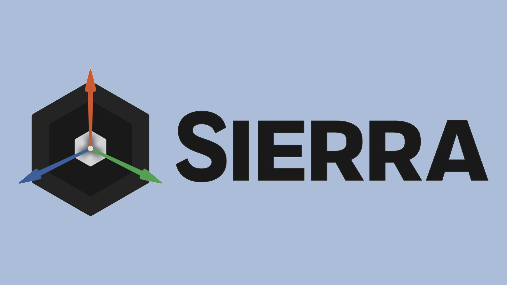

[](https://bit.ly/3OMysM8)

# Sierra Engine  
   



<br>

# What is Sierra Engine?

An **open-source** rendering engine based on **[C++20](https://en.cppreference.com/w/cpp/20/)**, which aims to provide users with an all-in-one development kit, suited for any graphics-intensive tasks (such as video games, 3D editors, etc.). Built on top of the **[Vulkan](https://vulkan.org/)** and [Metal](https://developer.apple.com/metal/) rendering APIs, it provides support for **Windows 7-11**, **macOS**, **Linux**, **Android** and **iOS** (check out [System Requirements](#-system-requirements)), and is planned to also feature other native APIs (like **[DirectX](https://developer.nvidia.com/directx)**), as well as support consoles.

<br>

## 🛠️ Building and Running the Engine

**List of compatible compilers:**

The following compilers have been tested and confirmed to be capable of successfully building the project. Others may still be used, though there could be building issues.
* [](https://visualstudio.microsoft.com/vs/)
* [](https://clang.llvm.org/)
* [](https://gcc.gnu.org/)
* [](https://developer.apple.com/xcode/)

<br>

**Prerequisites:**

In order to build it, you must have the following modules installed:
* **[Git](https://git-scm.com/downloads/)**
* A C++ compiler (preferably one of the listed [here](#-building-and-running-the-engine))
* **[CMake](https://cmake.org/download/)** 3.20 or higher
* **[VulkanSDK](https://vulkan.lunarg.com)** (optional for [Apple](https://apple.com/) platforms)
* **[Python](https://python.org/downloads/)** (only required if building for [Android](https://android.com/))

<br>

**Installation:**

Simply clone the repository either directly from your favourite IDE (**[Visual Studio](https://visualstudio.microsoft.com)**, **[CLion](https://jetbrains.com/clion/)**, etc.), or by opening the command line and running:

```bat
$ git clone --recursive https://github.com/NikolayKanchevski/SierraEngine
```

<br>

Also, do not forget to update git submodules like so:

```bat
$ git submodule update --init --recursive
```

And there you have it! You can now create your very own applications using the Sierra Engine and/or libraries.

<br>

## 💻 System Requirements

Minimal system requirements for every supported platform of the [Sierra](Sierra) API are listed here. Built on top of it, the whole [Sierra Engine](SierraEngine) shares the exact same requirements. *Do note that the following information is a subject to change.*

<br>

### Minimum Operating System Version

|  **[Windows](https://microsoft.com/en-us/windows/)**  | **[Linux](https://linux.org/)** |                      **[macOS](https://apple.com/macos/)**                      |               **[Android](https://android.com/)**                |        **[iOS](https://apple.com/ios/)**         |
|:-----------------------------------------------------:|:-------------------------------:|:-------------------------------------------------------------------------------:|:----------------------------------------------------------------:|:------------------------------------------------:|
| [Windows 7](https://bg.wikipedia.org/wiki/Windows_7/) | Any [Linux](https://linux.org/) | [macOS 10.13.0 (High Sierra)](https://en.wikipedia.org/wiki/MacOS_High_Sierra/) | [Android 13.0](https://developer.android.com/about/versions/13/) | [iOS 13.0](https://en.wikipedia.org/wiki/IOS_13) |

<br>

### Minimal GPU

|                        [AMD](https://amd.com/en.html/)                        |                               [NVIDIA](https://nvidia.com/en-us/)                                |               [Intel](https://intel.com/content/www/us/en/homepage.html)               |                     **[Android](https://android.com/)**                     |                                                                   [Apple]([Apple](https://apple.com/))                                                                    |
|:-----------------------------------------------------------------------------:|:------------------------------------------------------------------------------------------------:|:--------------------------------------------------------------------------------------:|:---------------------------------------------------------------------------:|:-------------------------------------------------------------------------------------------------------------------------------------------------------------------------:|
| Radeon HD 7970 ([GCN](https://en.wikipedia.org/wiki/Graphics_Core_Next/) 1.0) | GeForce GeForce GT 630 OEM ([Kepler](https://en.wikipedia.org/wiki/Kepler_(microarchitecture)/)) | HD Graphics 2000 [Skylake](https://en.wikipedia.org/wiki/Skylake_(microarchitecture)/) | Any [Android 13.0](https://developer.android.com/about/versions/13/) device | [Apple Silicon](https://bg.wikipedia.org/wiki/Apple_Silicon/) ([M1 Chip](https://en.wikipedia.org/wiki/Apple_M1/)) / [Apple A13](https://en.wikipedia.org/wiki/Apple_A13) |

<br>

### Minimum Graphics API Version

|                                                      | **[Windows](https://microsoft.com/en-us/windows/)** | **[Linux](https://linux.org/)** | **[macOS](https://apple.com/macos/)** | **[Android](https://android.com/)** | **[iOS](https://apple.com/ios/)** |
|:----------------------------------------------------:|:---------------------------------------------------:|:-------------------------------:|:-------------------------------------:|:-----------------------------------:|:---------------------------------:|
|          **[Vulkan](https://vulkan.org/)**           |                         1.2                         |               1.2               |                   ❌                   |                 1.2                 |                 ❌                 |
| **[DirectX](https://developer.nvidia.com/directx/)** |                          ❌                          |                ❌                |                   ❌                   |                  ❌                  |                 ❌                 |
|   **[Metal](https://developer.apple.com/metal/)**    |                          ❌                          |                ❌                |                  3.0                  |                  ❌                  |                3.0                |
|      **[OpenGL](https://khronos.org/opengl/)**       |                          ❌                          |                ❌                |                   ❌                   |                  ❌                  |                 ❌                 |

NOTE: Some systems might support multiple APIs, meaning their respective users would be free to change their rendering backend at any time.

<br>

### Minimal GPU (per Graphics API)

|                                                      |                        [AMD](https://amd.com/en.html/)                        |                               [NVIDIA](https://nvidia.com/en-us/)                                |               [Intel](https://intel.com/content/www/us/en/homepage.html)               |                     **[Android](https://android.com/)**                     |                                                                        [Apple](https://apple.com/)                                                                        |
|:----------------------------------------------------:|:-----------------------------------------------------------------------------:|:------------------------------------------------------------------------------------------------:|:--------------------------------------------------------------------------------------:|:---------------------------------------------------------------------------:|:-------------------------------------------------------------------------------------------------------------------------------------------------------------------------:|
|          **[Vulkan](https://vulkan.org/)**           | Radeon HD 7970 ([GCN](https://en.wikipedia.org/wiki/Graphics_Core_Next/) 1.0) | GeForce GeForce GT 630 OEM ([Kepler](https://en.wikipedia.org/wiki/Kepler_(microarchitecture)/)) | HD Graphics 2000 [Skylake](https://en.wikipedia.org/wiki/Skylake_(microarchitecture)/) | Any [Android 13.0](https://developer.android.com/about/versions/13/) device |                                                                                     ❌                                                                                     |
| **[DirectX](https://developer.nvidia.com/directx/)** |                                       ❌                                       |                                                ❌                                                 |                                           ❌                                            |                                      ❌                                      |                                                                                     ❌                                                                                     |
|   **[Metal](https://developer.apple.com/metal/)**    |                                       ❌                                       |                                                ❌                                                 |                                           ❌                                            |                                      ❌                                      | [Apple Silicon](https://bg.wikipedia.org/wiki/Apple_Silicon/) ([M1 Chip](https://en.wikipedia.org/wiki/Apple_M1/)) / [Apple A13](https://en.wikipedia.org/wiki/Apple_A13) |
|      **[OpenGL](https://khronos.org/opengl/)**       |                                       ❌                                       |                                                ❌                                                 |                                           ❌                                            |                                      ❌                                      |                                                                                     ❌                                                                                     |

<br>

## 💫 Features

```c++
// TODO: Add to this section :D
```

<br>

## 📄 Documentation

Documentation has not yet been made publicly available, but will be once a release is out. You can expect to see it on [Sierra's website](https://sierra.nikichatv.com).

<br>

## 📐 Modules

Despite the repository being named after the [Sierra Engine](SierraEngine), it encapsulates multiple libraries, upon which the engine is build. This means one could easily strip out any of them, and work with the provided low-level tools and abstractions, without having to use the engine itself. They are listed here:

**[Sierra](Sierra):**
* Description: Contains seamless abstractions for all kinds of low-level mechanisms, such as windowing, input polling, file management, build systems, and other platform-specific functionalities, as well as the cross-API rendering layer.
* Type: Static or shared.
* Local dependencies: None.

**[Sierra Engine](SierraEngine):**
* Description: Build atop the core API, it provides all engine features, including asset management, scenes, entities and components, renderers, and many more.
* Type: Static or shared.
* Local dependencies: [Sierra API](Sierra).

**[Sierra Engine Editor](SierraEngineEditor):**
* Description: A user interface for easy management of engine assets and runtime application programming. Exports all necessary files in a fast runtime-only format and crates final product.
* Type: Executable.
* Local dependencies: [Sierra Engine](SierraEngine).

**[Sierra Engine Runtime](SierraEngineRuntime):**
* Description: End product exported by a formerly editor-based application.
* Type: Executable.
* Local dependencies: [Sierra Engine](SierraEngine).

<br>

## 🤓️ About

### Frameworks used:

**Within [Sierra](Sierra)**:
* [GLM](https://github.com/g-truc/glm/) - Provides the engine with a powerful set of tools for solving linear algebra problems.
* [spdlog](https://github.com/gabime/spdlog) - Used for fast, asynchronous debug-only logging.
* [Vulkan](https://vulkan.org/) - Allows for incredibly fast rendering on a wide variety of platforms.
* [VMA](https://gpuopen.com/vulkan-memory-allocator/) - For optimal memory management of [Vulkan](https://vulkan.org/) objects.
* [Metal](https://developer.apple.com/metal/) - Being their native rendering API, it is used for fast, hardware-accelerated rendering on [Apple](https://apple.com) platforms.
* [android-cmake](https://github.com/taka-no-me/android-cmake) - Essential for building the engine on Android.
* [ios-cmake](https://github.com/leetal/ios-cmake) - Essential for building the engine on iOS.
* [ImGui](https://github.com/ocornut/imgui) - Used in the ImGui UI extension.
* [My Brain](https://ih1.redbubble.net/templateOutputImage.528192883.5730/st,small,845x845-pad,1000x1000,f8f8f8.u9.jpg) - There is not much left of it, actually...

**Within [Sierra Engine](SierraEngine)**:
* [entt](https://github.com/skypjack/entt) - Efficient entity component system, utilized in scenes.
* [stb](https://github.com/nothings/stb/) - An all-round image loader.
* [KTX Software](https://github.com/KhronosGroup/KTX-Software) - Used to compress texture assets.
* [ShaderConnect](https://github.com/NikolayKanchevski/ShaderConnect/tree/sierra) - A dedicated branch of the shader cross-compilation framework.

<br>

### Software used:

* [JetBrains CLion](https://jetbrains.com/clion/) - Primary IDE of the project.
* [JetBrains Rider](https://jetbrains.com/rider/) - Another IDE which was used to create the .NET 6.0 prototype version of the engine.
* [Xcode](https://developer.apple.com/xcode/) - Used to deploy the iOS version on mobile [Apple](https://apple.com) devices.
* [Android Studio](https://developer.android.com/studio/) - Needed for the deployment of [Android](https://android.com) version.
* [Blender](https://blender.org/) - Managing and testing models and assets.
* [Trello](https://trello.com/b/RMYtZPOg/sierra-engine/) - For pretending to have an organized list of things to implement next.
